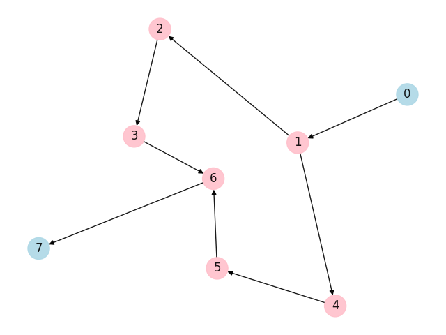

# Notation

## Getting started

Import the module:
```python
from notation import Notation
```

Create a ```Notation``` instance from an input text:
```python
notation = Notation.parse(text)
```

To display the resulting graph run:
```python
notation.draw()
```

## Notation Description
The notation describes the structure of a very simple planar graph with data flow.  
The notation is composed out of lines and forks representing the edges of the graph, nodes are implicit.
Anchors are also part of the notation, they can be used to reference an existing node.
The notation string has three main parts, an initial list of data elements that will flow through the graph, 
the base part and the appendix.  
The base part describes the initial structure. 
Any references used must be described in the appendix.
Initial data flow description, base and appendix are seperated by a new line (```\n```).

The appendix can contain multiple lines seperated by a new line.
Each line describes one reference. 
It consists of a reference key followed by a colon and the description of the subgraph in valid notation.


#### Line
A line segment is represented by ```-```, it connects two nodes.  
A line is composed of one or multiple line segments. It can be writen as:  
```-```: one line,  
```--```: two lines,  
```-n-```: n + 2 lines.

#### Fork
A fork connects one node to multiple sub graphs and optionally joins them together in the end.  
A fork is denoted by ```<[RS]>```. Where ```RS``` is a comma seperated list of references 
with a list of data flow elements.  
An Example fork is ```<[($1: [A, B]), ($2: [C])]>```, where the fork has two branches with the first one receiving 
the data elements ```A``` and ```B```, and the second receiving ```C```.

#### References
A reference enables the usage of a sub graph, as well as multiple and asymmetric paths in a fork.  
Denoted by ```$N```, where ```N``` is some number identifying the reference. 
A used reference must be defined in the appendix.  
References can also use other references.  
Note: there is no check for cyclic references; the input is expected to be valid.

### Anchors
Anchors are denoted by ```!N``` where ```N``` is some number.  
They are a notation element and are used as reference for a node, 
this enables multiple paths to end at one specific node.

## Examples

### Example 1
Notation:
```
[]
-<[($1: []), ($2: [])]>-
$1: -
$2: -
```

Plot:



### Example 2
Notation:
```
[A,B,C]
<[($1: [A,C]), ($2: [B])]>
$1: !1
$2: !1
```

Plot:


### Example 3
Notation:
```
[A,B,C]
-<[($1: [A,B]), ($2: [C])]>-
$1: -<[($3: [A]), ($2:[B])]
$2: !1
$3: -!1
```

Plot:


